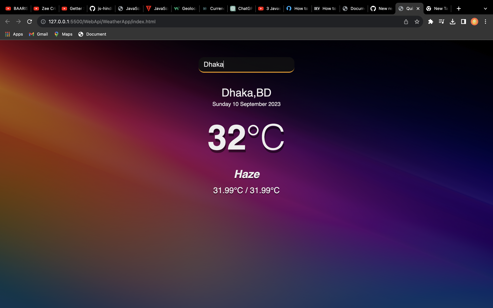

### Screenshot

The Weather App is a simple web application that allows users to get the current weather conditions for a specific location. It utilizes the OpenWeatherMap API to retrieve weather data.

### This  sample project is for learning html, css, javascript.